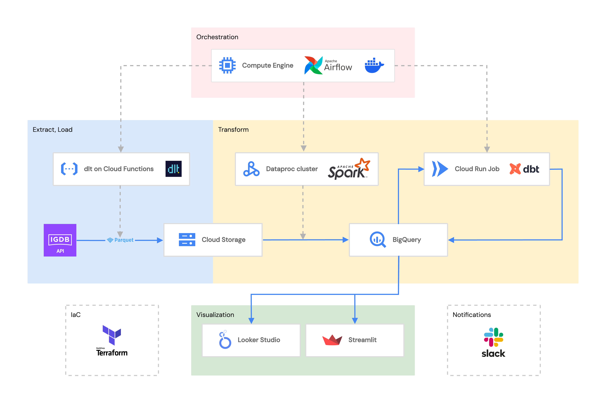
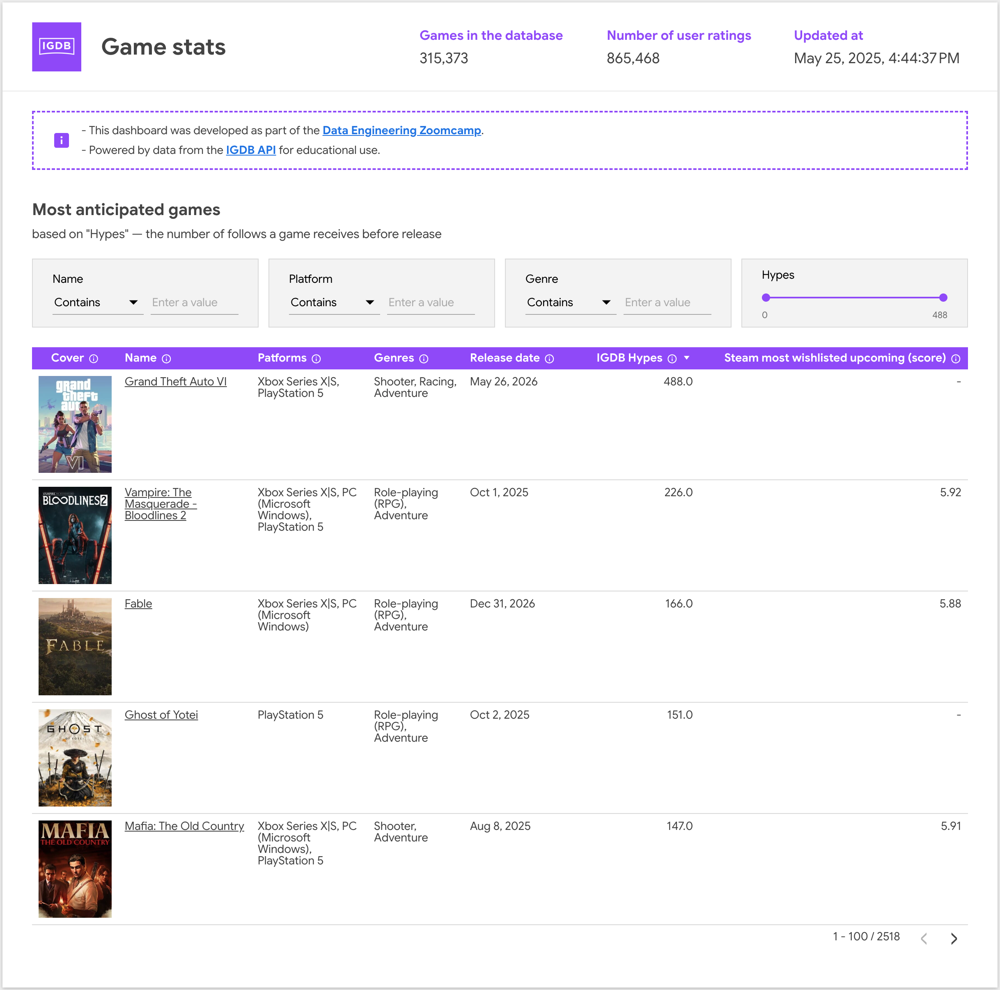
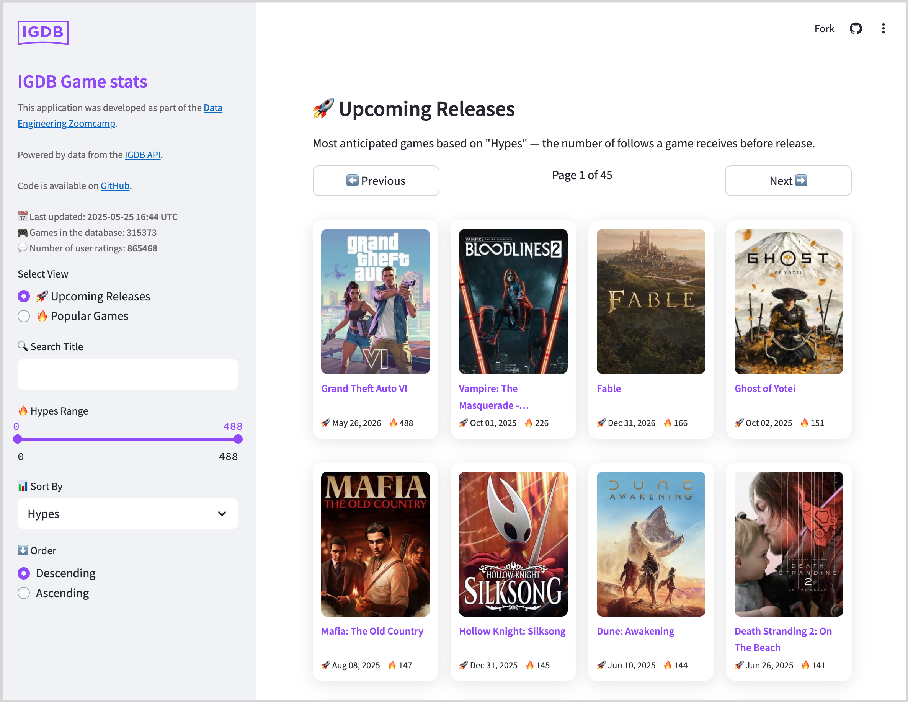

# IGDB Games Data Pipeline

## Overview

This project demonstrates an end-to-end data pipeline built using modern data engineering tools and cloud services. The pipeline extracts video games data from [IGDB API](https://api-docs.igdb.com/), processes it through several stages, and presents insights via a [Looker Studio dashboard](https://lookerstudio.google.com/reporting/53787c21-0269-4ec8-9312-431debe922ab) and a [Streamlit app](https://igdb-game-data.streamlit.app/).

*Note: This project was built as part of the [Data Engineering Zoomcamp course](https://github.com/DataTalksClub/data-engineering-zoomcamp/) to demonstrate various data engineering tools and technologies. While some components could be simplified, the current architecture showcases the practical application of course concepts.*

## Problem Statement

The project aims to create a data pipeline that collects and processes video game data from IGDB, combining it with popularity metrics from both IGDB and Steam platforms to provide insights into:

- Top-rated games based on user ratings and popularity
- Most anticipated upcoming games based on pre-release interest
- Relative popularity of games on Steam platform

The final result is a [dashboard in Looker Studio](https://lookerstudio.google.com/reporting/53787c21-0269-4ec8-9312-431debe922ab/page/VsaqC).

## Architecture



### Data Flow:

1. **Extraction**: A Cloud Run function using `dlt` extracts data from IGDB API endpoints and stores it as Parquet files in Google Cloud Storage (GCS).
2. **Processing**: A Dataproc cluster runs PySpark jobs to process the Parquet files in GCS, slightly modifies the data, and loads it into a BigQuery dataset.
3. **Transformation**: `dbt` transforms the source data in BigQuery into analytics-ready models within a separate BigQuery dataset.
4. **Visualization**: Looker Studio connects to the transformed data in BigQuery to create interactive dashboards. Streamlit app connects to a BigQuery data source, caches the data, and displays a grid of cards featuring popular games and hot upcoming releases. 
5. **Orchestration**: Airflow on a Compute Engine VM orchestrates the entire pipeline, scheduling and managing the execution of each step.

## Technologies Used

- **Google Cloud Platform**
  - Cloud Storage
  - Cloud Run Functions
  - Cloud Run Jobs
  - Dataproc
  - BigQuery
  - Compute Engine
  - Artifact Registry
- **Data Tools**
  - [dlt](https://github.com/dlt-hub/dlt) (data loading tool)
  - Apache Spark
  - dbt
  - Apache Airflow
- **Infrastructure as Code**
  - Terraform
- **Containerization**
  - Docker
- **Other Tools**
  - [uv](https://github.com/astral-sh/uv) (Python package and project installer)
  - Looker Studio
  - Streamlit

## Prerequisites

1. Google Cloud Platform account with billing enabled
2. IGDB API credentials (Client ID and Bearer Token): [step-by-step instructions](https://api-docs.igdb.com/#account-creation).
3. Terraform installed locally: [guide](https://developer.hashicorp.com/terraform/install).
4. Make sure that Python 3.8+ installed on your local machine.
5. Download and install [Docker Desktop](https://www.docker.com/products/docker-desktop/).
6. Install [Google Cloud CLI](https://cloud.google.com/sdk/docs/install) on your local machine.
7. Slack incoming webhook for notifications: [instruction](https://api.slack.com/messaging/webhooks).

## Setup Instructions

### 1. Clone Repository

```bash
git clone <repository_url>
cd igdb-game-data
```

### 2. Configure Service Account and secrets

In your Google cloud project create 4 service accounts:
- **Service account for Terraform** with the following roles:
    - BigQuery Admin
    - Cloud Functions Admin
    - Compute Admin
    - Compute Security Admin
    - Dataproc Administrator
    - Service Account User
    - Storage Admin
    - Secret Manager Admin
- **Service account for Airflow** with the following roles:
    - Cloud Functions Invoker
    - Cloud Run Admin
    - Cloud Run Invoker
    - Dataproc Editor
    - Storage Object Viewer
- **Service account for dbt** with the following roles:
    - BigQuery Data Editor
    - BigQuery User
- **Service account for Streamlit** with the following roles:
    - BigQuery Data Viewer
    - BigQuery Job User


For each service account, create a JSON key and download the key into the /secrets/ directory located in the root folder of the project with following names:
- airflow-sa.json
- dbt-sa.json
- terraform-sa.json
- streamlit-sa.json

**Important**: Ensure that the /secrets/ folder is listed in the .gitignore file to avoid committing sensitive keys.


Navigate to Google Cloud Console -> Secret Manager and create 3 secrets and paste respective values into Value fileds:

- IGDB_BEARER_TOKEN
- IGDB_CLIENT_ID
- SLACK_INCOMING_HOOK


### 3. Create Docker image fro dbt and push to the Artifact Registry

Create a Docker repo in you Google Cloud project (replace project and location with your values):

```bash
gcloud artifacts repositories create igdb-dbt-repo \
  --project=course-data-engineering \
  --repository-format=docker \
  --location=europe-west2
```

Build and push Docker image:

```bash
cd dbt
gcloud builds submit \
  --project=course-data-engineering \
  --tag=europe-west2-docker.pkg.dev/course-data-engineering/igdb-dbt-repo/igdb-dbt-image:latest
```

### 4. Infrastructure Setup

Initialize Terraform:

```bash
cd terraform
terraform init
```

Apply Terraform configuration:

```bash
terraform plan
terraform apply
```

This will provision the following resources in your Google Cloud project:

- **Cloud Run function** (igdb-dlt-pipeline) to extract data from IGDB API using dlt 
- **Google Cloud Storage bucket** (igdb-game-data) to store extracted data
- **Dataproc cluster** (igdb-dataproc-cluster) for batch processing using PySpark jobs
- **BigQuery datasets** (igdb_source, igdb_dwh) for storing processed data
- **Compute Engine VM** for orchestrating jobs using Airflow

**Airflow UI** will be available at `<your-vm-ip-address>:8080`. The default credentials are `airflow` for both username and password. Remember to change the default password!


### 5. Run the Pipeline

You can trigger the pipeline by:

- Scheduling the Airflow DAG:
  - The Airflow DAG ([igdb_pipeline](airflow/dags/igdb_pipeline.py)) is configured to run daily at 4:00 AM.
- Manually triggering the Airflow DAG:
  - You can trigger the DAG from the Airflow UI.

The [igdb_pipeline DAG](airflow/dags/igdb_pipeline.py) consists of 3 tasks:
- run_cloud_function
- submit_dataproc_job
- execute_cloud_run_job


**Data Model**

The data model consists of two BigQuery datasets:

- **igdb_source:**
  
  This dataset contains the raw data extracted from the IGDB API. Tables in this dataset include:
  - `games`
  - `game_statuses`
  - `game_types`
  - `genres`
  - `external_game_sources`
  - `platforms`
  - `popularity_primitives`
  - `popularity_types`
  
- **igdb_dwh:**
  
  This dataset contains the transformed data models used for the Looker Studio dashboard. Tables in this dataset include:
  - `games_dashboard`: Main model combining game details with popularity metrics
  - `steam_popularity_primitives`: Steam-specific popularity metrics
  - `igdb_popularity_primitives`: IGDB-specific popularity metrics

The [schema.yml](dbt/igdb_data_transform/models/dwh/schema.yml) file provides detailed descriptions of the tables and columns in the igdb_dwh dataset.


### 6. Create Looker Studio Dashboard

Open https://lookerstudio.google.com/navigation/reporting, click Create and add select Data source.
In the dialog select Bigquery connector, then specify your project, dataset and table with processed data, and click Connect.
After connecting the dataset you can click Create report and start visualizing your data.




Access the dashboard [here](https://lookerstudio.google.com/reporting/53787c21-0269-4ec8-9312-431debe922ab)

### 7. Create a Streamlit app

A grid of cards featuring popular games and hot upcoming releases is published on [Streamlit Community Cloud](https://streamlit.io/cloud). An app also enables filtering, sorting and pagination. It also caches data for 24h and uses [Polars](https://pola.rs/) for dataframes processing to optimize performance and reduce unnecessary queries to BigQuery.



The app is available [here](https://igdb-game-data.streamlit.app/).
